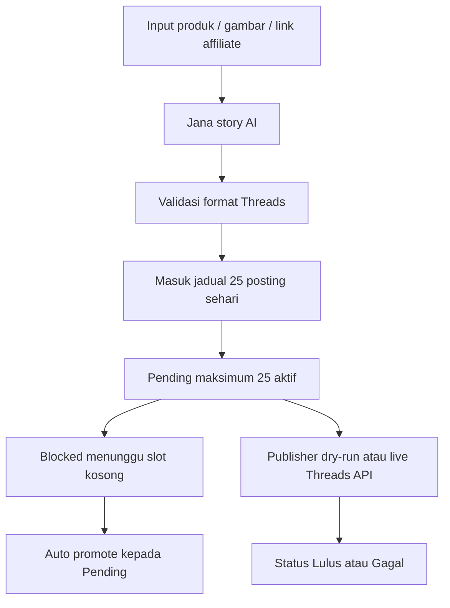

# Sistem Marvis Threads Auto (SMTA)

**Sistem Marvis Threads Auto (SMTA)** ialah sistem automasi kandungan Threads untuk affiliate marketing. Sistem ini membantu jana story produk dalam Bahasa Melayu Malaysia, susun jadual 25 posting sehari, pantau status queue, dan sediakan publisher automatik melalui Threads API.

Nama rasmi sistem:

| Item | Maklumat |
| --- | --- |
| Nama sistem | Sistem Marvis Threads Auto (SMTA) |
| Repo slug | smta |
| Versi | v0.7.7 |
| Bahasa UI | Bahasa Melayu Malaysia |
| Zon masa | Asia/Kuala_Lumpur |
| Kredit | Sistem Dibangunkan Sepenuhnya Oleh Akmal Marvis |
| Localhost rasmi | `http://localhost/smta/` |

## Fungsi Utama

- Jana siri 3 post Threads: `[POST UTAMA]`, `[REPLY 1]`, `[REPLY 2]`.
- Storytelling deep storyline untuk netizen Malaysia.
- Input produk melalui gambar upload, paste gambar, link gambar, nota produk, dan link affiliate.
- Pilihan posting sehari termasuk `25 posting / hari`.
- Auto cipta story dan terus masukkan ke jadual SMTA.
- Kalendar jadual harian dengan semakan 25 slot sehari.
- Status posting: `Lulus`, `Pending`, `Blocked`, `Gagal`, dan `Disediakan`.
- Auto promote `Blocked` kepada `Pending` bila slot schedule kosong.
- Publisher Threads API dengan mode `Dry-run` dan mode live apabila token rasmi sudah diset.
- UI refresh gaya Kumo UI dan `gpt-taste`: semantic color token, surface hierarchy, sidebar premium, table compact, focus state jelas, dan motion GSAP yang ringan.

## Cara Jalankan

Keperluan:

- Node.js 18 atau lebih baru.
- Akaun DeepSeek jika mahu jana story AI.
- Threads API user ID dan access token jika mahu publish live.

Pasang dan jalan:

```bash
npm install
npm run start
```

URL rasmi localhost pada PC ini menggunakan Apache/XAMPP:

```text
http://localhost/smta/
```

Untuk deploy semula fail static ke XAMPP:

```bash
npm run deploy:xampp
```

Jika mahu jalan terus dengan Node tanpa XAMPP, guna fallback dev:

```bash
npm run start:dev
```

```text
http://localhost:8791/smta/
```

Jalankan server AI dalam terminal lain:

```bash
npm run ai
```

Server AI default:

```text
http://127.0.0.1:8788
```

## API Key

SMTA tidak commit API key ke repo.

Pilihan DeepSeek:

```bash
set DEEPSEEK_API_KEY=sk-...
npm run ai
```

Atau simpan dalam fail private:

```text
work/private/deepseek.key
```

Threads access token pula boleh disimpan melalui GUI Publisher atau melalui env:

```bash
set THREADS_ACCESS_TOKEN=...
```

Fail private yang diabaikan git:

```text
work/private/
publish-log.json
.env
```

## Struktur Sistem

```text
smta/
|-- assets/
|   |-- flexi-marble-sheet.png
|   |-- smta-favicon.svg
|   `-- smta-logo.svg
|-- scripts/
|   `-- deploy-xampp.ps1
|-- ai-server.mjs
|-- app.js
|-- index.html
|-- server.mjs
|-- status.json
|-- story-runs.json
|-- styles.css
|-- threads_flexi_marble_schedule.json
|-- package.json
|-- .env.example
|-- .gitignore
`-- README.md
```

## Database JSON

SMTA menggunakan JSON file database supaya ringan dan mudah audit.

| Fail | Fungsi |
| --- | --- |
| `threads_flexi_marble_schedule.json` | Senarai siri posting, slot jadual, CTA, dan affiliate link. |
| `status.json` | Status queue semasa: scheduled, posted, failed, remaining, dan publisher config ringkas. |
| `story-runs.json` | Rekod output story yang dijana oleh AI. |
| `publish-log.json` | Log publisher runtime. Fail ini tidak di-commit. |
| `work/private/*.json` dan `work/private/*.txt` | Token/API key private. Fail ini tidak di-commit. |

## Workflow Automation



## Prinsip Reka Bentuk

SMTA kini mengambil inspirasi daripada Kumo UI tanpa menukar stack vanilla:

- Semantic token untuk warna, teks, border, status dan surface.
- Surface hierarchy yang jelas untuk sidebar, dashboard, calendar, queue, preview dan publisher.
- Komponen gaya resource-list dan compact table untuk status posting.
- Focus state dan hover state yang lebih jelas untuk penggunaan harian.
- Motion GSAP ringan untuk reveal dan hover, bukan animasi berat.

## Nota Had Threads

SMTA mengekalkan queue aktif maksimum 25 siri Pending untuk mengelakkan jadual bertindih. Baki siri akan kekal `Blocked` sehingga slot kosong. Status hanya patut dianggap `Pending` selepas SMTA berjaya memasukkan siri ke queue automation.

## Version Log

### v0.7.7

- Guna prinsip Kumo UI pada SMTA tanpa menukar stack vanilla: semantic tokens, surface hierarchy, table/resource-list pattern, focus states, dan badges status yang lebih jelas.
- Ganti CSS lama yang bertindih dengan design system lebih kecil, konsisten, dan mudah dibaca.
- Kemas cache CSS kepada `styles.css?v=10` dan tambah `data-mode="light"` serta `data-theme="kumo"` pada HTML.

### v0.7.6

- Tukar default SMTA kepada `25 posting / hari`.
- Tambah option `25 posting / hari` di Jana Story dan `25 siri` di automasi publisher.
- Kalendar Jadual Threads kini menyemak sasaran 25 slot sehari.

### v0.7.5

- Guna `redesign-skill` untuk audit dan polish targeted pada sistem SMTA.
- Tambah skip-link, meta description, OG metadata, state kosong yang lebih kemas, dan busy state untuk butang AI.
- Buang pautan palsu apabila affiliate link tiada dan kemaskan surface visual supaya dashboard lebih profesional.

### v0.7.4

- Kunci responsive mobile supaya panel SMTA tidak melebar keluar viewport.
- Topbar dan metrik dipaksa kepada satu kolum pada skrin kecil untuk bacaan lebih selesa.

### v0.7.3

- Tambah option `20 posting / hari` dan jadual kalendar harian.
- Auto schedule story yang dijana supaya fungsi Jana Story, Jadual Threads, dan status berkait.

### v0.7.2

- Tambah status story dijana.
- Sambungkan output AI kepada jadual tempatan SMTA.

### v0.7.1

- Kemaskan GUI dengan side menu dan modul berasingan.

### v0.7.0

- Release awal Sistem Marvis Threads Auto (SMTA).
